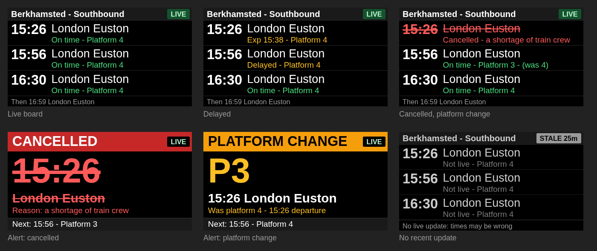

# Train Info Panel

A small **live UK train departure board** for your hallway, desk or kitchen wall. It runs on a cheap
Waveshare ESP32-C6 touch-screen board, shows the next trains from one station, and tells you when something
changes: a cancellation, a platform change, a long delay. It needs no phone, no app and no server at home: it
talks straight to National Rail's live data over your Wi-Fi.



*(Rendered at the real 320x172 resolution. The panel looks just like this.)*

- **Glanceable:** three trains, one per row: time, destination, then status and platform. Colour is never the
  only signal; every state also changes the words.
- **Honest:** a green `LIVE` chip while the data is fresh. If updates stop, it turns amber and says `STALE`.
  It never shows an old time as if it were current.
- **Swipe** left or right to change direction, e.g. Southbound / Northbound / All trains. It is instant.
- **Alerts:** when the next train is cancelled, changes platform, or is badly late, a full-screen alert says so.
- **Quiet at night:** overnight the screen switches off and it stops fetching; a touch wakes it.
- **Yours to configure:** one plain text file, `config.ini`. No programming, no rebuilding.

Works for any station in Great Britain that National Rail publishes live data for.

## What you need

- A **Waveshare ESP32-C6-Touch-LCD-1.47** board ([product docs](https://docs.waveshare.com/ESP32-C6-Touch-LCD-1.47))
  and a USB-C cable.
- A **2.4 GHz Wi-Fi** network (the board cannot join 5 GHz-only networks).
- A computer with **Python 3.9 or newer** and a USB port, to set the panel up. (Linux, macOS or Windows.)
- A free **Rail Data Marketplace** account for the live data (step 1 below).

## Set it up

### 1. Get a data key (free)

The live data comes from National Rail's **Live Departure Board Web Service**, available free for personal use
through the **Rail Data Marketplace**. You need to register to get a key.

1. Go to **<https://raildata.org.uk>** and create an account. Registration is reviewed by hand, so approval can
   take from a few minutes to a few days.
2. Once approved, sign in and open the **Data Product Catalogue**. Search for **"Live Departure Board"** and
   choose **Live Departure Board Web Service (LDBWS) - Public**. (Not the "Staff" version.)
3. **Subscribe** to it and accept the licence terms.
4. Open your subscription and copy the **Consumer key**. That one string is your data key. (You do not need the
   secret.) Keep it private: it identifies you to the service.

The website changes now and then, so button names may differ slightly. Whatever the layout, what you need at
the end is the key for the LDBWS Public product. The free tier is believed to allow roughly 100,000 requests a
month; the default settings use about 40,000, and the setup tool estimates your usage and warns you.

### 2. Download this project and the firmware

- Download or `git clone` this repository.
- Download the latest firmware image, **`train-info-panel-<version>.bin`**, from this repository's **Releases**
  page, into the repository folder. (Prefer to build it yourself? See [Build it yourself](#build-it-yourself).)

### 3. Install the settings tool's helpers

The settings tool (`tools/provision.py`) needs Python 3.9 or newer and two small packages. In the repository
folder (a virtual environment is tidy but optional):

```sh
python3 -m venv .venv && source .venv/bin/activate        # Windows: .venv\Scripts\activate
pip install -r tools/requirements.txt
```

### 4. Edit your config file

```sh
cp config.example.ini config.ini                          # Windows: copy config.example.ini config.ini
```

Open **`config.ini`** in any text editor. It is fully commented. The things you must change:

| Setting | What to put |
|---|---|
| `[wifi]` `ssid`, `password` | Your 2.4 GHz Wi-Fi name and password |
| `[api]` `key` | The Consumer key from step 1 |
| `[station]` `crs`, `name` | Your station's 3-letter code (e.g. `BKM`) and the name to show |
| `[direction.1]` ... | The directions you want to swipe between (see below) |

**Finding your station's code:** National Rail's official list of 3-letter station codes is at
<https://www.nationalrail.co.uk/stations_destinations/48541.aspx>. They are the codes on departure boards
(`BKM` Berkhamsted, `HML` Hemel Hempstead, `EUS` London Euston).

**Setting up directions.** LDBWS has no "direction", so each direction is defined as *trains that call at a
particular neighbouring station*. For a direction of travel, give the **next station along the line** in that
direction: every train that way stops there, whatever its final destination. For example, from Berkhamsted:

```ini
[direction.1]          # shown first, and after a restart
label = Southbound     # the text in the header (max 16 characters)
toward = HML           # Hemel Hempstead is the next station towards London

[direction.2]
label = Northbound
toward = TRI           # Tring is the next station the other way

[direction.3]
label = All trains
toward =               # empty = every train
```

You can have up to five directions, or just one (then swiping does nothing). Everything else (how often it
updates, how long alerts stay up, when the screen goes off at night, how sensitive swiping is) has a sensible
default and is documented in the file. You only change what you want to.

### 5. Check it

```sh
python3 tools/provision.py --check
```

This validates your file, estimates your monthly data use, and tests your key against the live service for each
direction, telling you plainly what is wrong ("HTTP 401: is the key right...", "station code..."). No panel
needed yet. Fix anything it reports and run it again.

### 6. Flash the firmware onto the panel

The release file `train-info-panel-<version>.bin` is one complete firmware image. It goes onto the panel
**at address `0x0`**. Use whichever flashing tool you prefer. Plug the panel in over USB first.

| Your situation | Tool |
|---|---|
| **Windows**, no command line | Espressif's [Flash Download Tool](https://docs.espressif.com/projects/esp-test-tools/en/latest/esp32c6/production_stage/tools/flash_download_tool.html): choose the ESP32-C6, add the `.bin` file with address `0x0`, pick the panel's port, press Start. |
| Any system with **Chrome or Edge** | Espressif's web flasher, [ESP Launchpad](https://espressif.github.io/esp-launchpad/) (its source is [here](https://github.com/espressif/esp-launchpad)): use its option to upload your own firmware file, with address `0x0`. |
| Any system, command line | [`esptool`](https://docs.espressif.com/projects/esptool/en/latest/esp32c6/esptool/flashing-firmware.html): `python3 -m esptool --chip esp32c6 write_flash 0x0 train-info-panel-<version>.bin` (add `-p <port>` if it does not find the panel). |

- **Not detected?** Hold the **BOOT** button while plugging in USB, then try again.
- **Serial port names:** Linux `/dev/ttyACM0`, macOS `/dev/cu.usbmodem...`, Windows `COM3` (see Device Manager).
- **Linux permissions:** if access is denied, add yourself to the serial group (`dialout` on Debian/Ubuntu, `uucp`
  on Arch) and log in again.

### 7. Write your settings to the panel

**Do this after flashing**: flashing the image blanks the settings area, so settings written earlier are lost.

```sh
python3 tools/provision.py
```

That writes everything in `config.ini` to the panel. It then restarts by itself (if it does not, unplug and
replug it) and within a minute shows the board. (`python3 tools/provision.py --port COM3` on Windows, or the macOS
port name, if it cannot find the panel on its own.)

If you use Python anyway, one command does steps 6 and 7 together:
`python3 tools/provision.py --firmware train-info-panel-<version>.bin`.

### Changing a setting later

Edit `config.ini` and run `python3 tools/provision.py` again. It takes seconds; the panel restarts with the new
settings. No reflashing, no rebuilding, nothing to download.

## Using the panel

| You see | It means |
|---|---|
| Green **LIVE** chip | The data is fresh. After a couple of minutes it shows its age: `LIVE 3m`. |
| Amber **STALE 12m** chip, "Not live" | No update for 10 minutes (Wi-Fi or the data service is down). Times may be wrong. It recovers by itself. |
| **No trains** | Nothing due in the next two hours for that direction. A real answer, not an error. |
| Full-screen **CANCELLED** / **PLATFORM CHANGE** / **DELAYED n MIN** | The *next* train has changed. It stays up briefly (shorter if you just touched the panel, longer if it appeared while you may not have been looking) and shows once per change. |
| Three dots in the header | Which direction you are on. Swipe to change. |
| Screen off | Quiet hours (default 21:00-06:00). Touch it: it wakes, refreshes, and stays on for two minutes. |

## Troubleshooting

| Symptom | Likely cause and fix |
|---|---|
| "Not configured" on the panel | No settings on it yet, or you flashed the firmware after writing them: run `python3 tools/provision.py`. |
| "No live data" + "Wi-Fi not connected" | Wrong name or password in `config.ini`, or a 5 GHz-only network. |
| "No live data" + "API key refused" | The key is wrong, or your subscription is not approved yet. Run `--check`. It retries every 15 minutes. |
| "No live data" + "No response from server" | Internet or DNS trouble at your end; it retries with backoff. |
| `STALE` chip | No successful update for 10 minutes. It recovers by itself when the problem clears. |
| Wrong or no trains | Check the station codes. Try them first with `python3 adapter/live_fetch.py --toward XXX`. |
| Screen dark in the daytime | The clock may not have synced yet (give it a minute), or your quiet hours are set wrongly. |
| Swipe does nothing | You have only one direction configured, or the touch controller was not found (see the serial log). |
| The tool or flasher cannot find the panel | Try another USB cable (some are charge-only), another port, or hold BOOT while plugging in. |
| Panel will not boot | Hold BOOT while plugging in, then `python3 -m esptool --chip esp32c6 erase_flash`, flash the image at `0x0` again, and re-run `tools/provision.py`. |

## Security and privacy

- Your Wi-Fi password and data key are written to the panel's own flash. They are **not encrypted**: anyone with
  the panel and a USB cable can read them back. That is reasonable for a read-only departure-board key and a
  home network if the panel stays at home. Erasing the flash removes them.
- **`config.ini` holds your secrets and is git-ignored. Never commit or share it.**
- The panel opens **no inbound connections**: no web page, no remote control, no update server. It only makes
  outbound requests (Wi-Fi, a time server, and HTTPS to `api1.raildata.org.uk`).
- Everything received from the network is treated as untrusted and size-checked.
- No personal data or recorded provider responses are stored in this repository.

## How it works

```
Rail Data Marketplace (LDBWS)  <--HTTPS, outbound only--  panel (ESP32-C6)
        your free key                                     Wi-Fi + key + settings in its own flash
```

The panel keeps a cached board for every direction. The one on screen refreshes every minute (by default), the
others every four minutes, so a swipe shows data immediately and refreshes at once if it is old. Nothing is
fetched during quiet hours. Requests have a 10-second timeout, a size cap, backoff when something fails, and
verified TLS. Design reasoning is recorded under [`docs/`](docs/).

## Limitations

- **Great Britain only**, and only what National Rail's live data covers. "On time" can mean "no live
  forecast yet"; the service does not say which.
- **No timetable fallback.** If live data is unavailable the panel shows the last good board, ageing to
  `STALE`; it does not substitute a schedule.
- The last good board is kept in memory only: after a reboot the panel shows "Loading..." until its first update.
- A platform *change* is spotted by comparing with the previous update, so the first update after a restart
  cannot flag one.
- Touch is swipe and wake only. The built-in font is regular weight.
- Not soak-tested over long periods yet. Reports welcome.

## Build it yourself

You do not have to: the release image is the same thing. But to build from source you need ESP-IDF v5.3.2
(Espressif's development kit). On Linux or macOS:

```sh
git clone -b v5.3.2 --recursive https://github.com/espressif/esp-idf.git ~/esp/esp-idf   # once
cd ~/esp/esp-idf && ./install.sh esp32c6                                                  # once

source ~/esp/esp-idf/export.sh                                                            # every new shell
cd firmware
idf.py set-target esp32c6                  # first time only
idf.py build
idf.py -p /dev/ttyACM0 flash monitor       # builds, flashes the app, shows the log (Ctrl+] exits)
```

`idf.py flash` replaces the firmware but **keeps your settings** (they live in a separate part of the flash).
To build the single-file release image instead (what the Releases page offers):

```sh
python3 tools/package_release.py           # -> dist/train-info-panel-<version>.bin
```

Windows users: Espressif's [installer](https://docs.espressif.com/projects/esp-idf/en/v5.3.2/esp32c6/get-started/windows-setup.html)
sets up the same environment. The code layout, tests and recovery steps are in
[`firmware/README.md`](firmware/README.md).

## Contributing

Want to change or extend it? [`CONTRIBUTING.md`](CONTRIBUTING.md) explains the code, how to build from source
and run the tests, and the design decisions behind it.

## Credits and licences

- Departure data: National Rail Enquiries / Rail Delivery Group, via the Rail Data Marketplace. Follow the
  licence you accept when subscribing. This project is not affiliated with or endorsed by National Rail.
- `firmware/components/esp_lcd_jd9853` is Espressif's JD9853 panel driver (Apache-2.0), vendored unmodified from
  Waveshare's demo package. `firmware/main/display/` is board bring-up derived from the same demo.
- The touch driver is original, written from the published register protocol. LVGL (MIT) and `esp_lvgl_port`
  (Apache-2.0) come from the ESP component registry; cJSON (MIT) ships with ESP-IDF.
- The visual design is original; other UK departure-board projects were studied for information design only,
  and no code, layouts or assets were copied.
- This project is licensed under the **Apache License 2.0** (see [`LICENSE`](LICENSE) and [`NOTICE`](NOTICE)). It is
  provided "as is", without warranty of any kind, and the authors are not liable for any damage arising from its
  use, including to your hardware. You flash and use it at your own risk.
